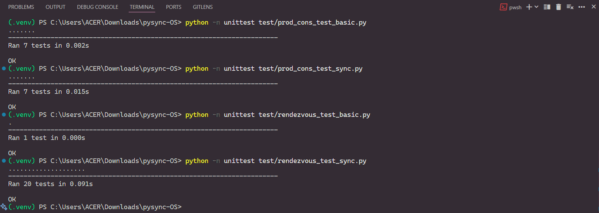

# Programming Lab

This programming lab is about to construct a library `pysync` with two services represented by classes.

* `GenProdCons` class: A Generic Producer-Consumer class, which enable to communicate two threads by using the well known synchronization
   **Producer-Consumer** pattern. This class create a common point of communication between two threads, where a thread has the role of produce, it can produce an element of any type, `put` into an instance of `GenProdCons` and a Consumer can `get`ing from the same instance.

```mermaid
---
title: GenProdCons class
---
classDiagram
   class GenProdCons {
       +put(e : E)
       +get()  E
   }
```

* `RendezvousDEchange` class: (Uh lala, el señor francés). A subtle modification of the Generic Producer-Consumer which doesn't have a
  buffer, or buffer has a side zero. This version will be enabled to swap two values between two threads. When the first thread put (`echanger`) the value on the `RendezvousDEnchange`, he waits until the second thread put (`echanger`) its value, when both threads meet (*rendezvous*) the values are swaped: thread A receives the value from thread B, and conversely.

```mermaid
---
title: RendezvousDEchage class
---
classDiagram
   class RendezvousDEchage {
      + echager(value:E) T
   }
```

## `GenProdCons` class

The constructor of this class receives only one parameter: `size`, the buffer size. $size > 0$.

## `RendezvousDEchange` class

The constructor of this class don't receive any parameter.

## Test

First, set the `PYTHONPATH` variable replace (`<path-of-your-project`) with your directory path.

Linux

```shell
export PYTHONPATH=$PYTHONPATH:<path-of-your-project>
```

Install two libraries

```shell
python3 -m pip install pytest parameterized
```

or

```shell
python -m pip install pytest parameterized
```

Windows

```shell
SET PYTHONPATH=%PYTHONPATH%;<path-of-your-project>
```

Install two libraries

```shell
python3 -m pip install pytest parameterized
```

or

```shell
python -m pip install pytest parameterized
```

Before to running the process you must define two environment variables:

Linux

```shell
export PRODCONSMODULE=<where-the-prod-cons-is-installed>
export RENDEZVOUSMODULE=<where-the-prod-cons-is-installed>
```

Windows

```shell
python3 -m unittest test/prod_con_test_<test_type>.py
python3 -m unittest test/rendezvous_test_<test_type>.py
```

```shell
python -m unittest test/prod_con_test_<test_type>.py
python -m unittest test/rendezvous_test_<test_type>.py
```

## Results



## Authors
* **Alejandro Osorno**
* **Sebastian Granda**